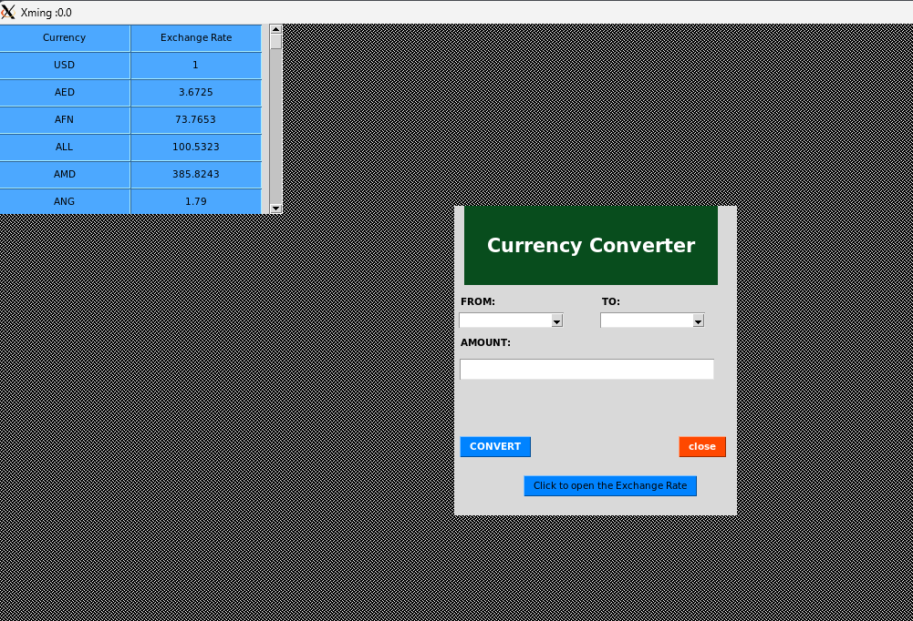

# Currency Converter App


A simple Python application that allows you to convert currency using exchange rates from the ExchangeRate-API. The application has a graphical user interface (GUI) built with the Tkinter library.

## Prerequisites
You can run this application inside a Docker container with X11 support on Windows. 
Before running the application on Windows with X11, make sure you have the following:

- X11 server installed on your Windows system (e.g., Xming or VcXsrv).
- Python 3.x installed on your system.
- API_KEY for the ExchangeRate-API.
- Necessary Python packages installed (requirements.txt).

## Getting Started

1. Clone the repository to your local machine:

   ```bash
   git clone https://github.com/RomanIgor/projectTk.git
   

2. Create a virtual environment (optional but recommended):
   - python -m venv venv source venv/bin/activate  # On Windows, use `venv\Scripts\activate`
3. Install the required packages:
   - pip install -r requirements.txt
4. Create a .env file in the project directory and add your API_KEY:
   - API_KEY=your_api_key_here
5. Build a Docker image for the application:
   - docker build -t currency-converter-app . #change the name of app if needed
6. Set the DISPLAY environment variable to point to your X11 server:
   - set DISPLAY=localhost:0.0  # Adjust the display number if needed

7. Run the Docker container with X11 support:
  - Before running Docker, you need to start the X11 server using the following command in the Xming directory
    - C:\Program Files (x86)\Xming>Xming.exe -ac
  - docker run -it --rm -e DISPLAY=your-host-number:0 -v /tmp/.X11-unix:/tmp/.X11-unix your-image-name 

## Usage

 - Select the source and destination currencies from the dropdown menus.
 - Enter the amount you want to convert.
 - Click the "CONVERT" button to get the converted amount.
 - The conversion result will be displayed below with the last update time.

## Additional Features

 - Click the "Click to open the Exchange Rate" button to open a separate window displaying exchange rates from the meintest.csv file.



## Acknowledgments

- Thanks to the ExchangeRate-API for providing exchange rate data.
- This project was created as a learning exercise and may have limitations.
